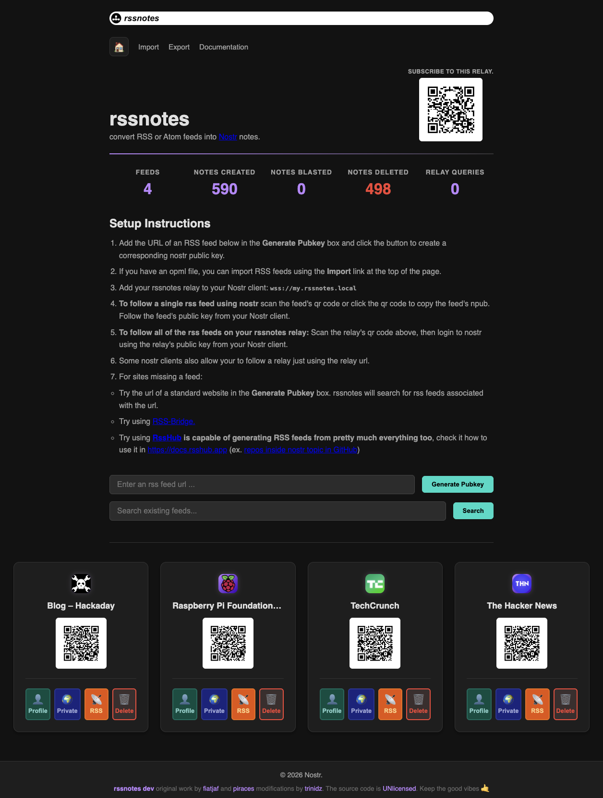

# RSSNOTES

rssnotes is a nostr relay that functions as an rss to nostr bridge by creating nostr profiles and notes from RSS feeds. rssnotes is a read only relay.  rssnotes is a fork of [rsslay](https://github.com/piraces/rsslay).

## Features

- Convert RSS feeds into Nostr profiles.
- Creates a npubkey and QR code for each RSS feed profile that you can use to follow the RSS feed on nostr.
- The rssnotes relay also has its own npubkey.  The rssnotes relay automatically follows all of the rss feed profiles. So if you login to nostr using the rssnotes relay you will see all of your RSS feeds.
- Import and export RSS feeds using an opml file.
- Option to automatically delete old notes.
- Make a feed public and blast its notes.
- Selection of relay metrics dislayed on main page. (Displayed metrics other than CURRENT FEEDS are per session and will reset if relay is restarted.)
- Prometheus metrics available on /metrics path.
- Search bar
- Relay logs exposed on the /log path.
- Using [khatru](https://github.com/fiatjaf/khatru)

## Screenshot



## Run the relay using docker compose
Prerequisites:
- [Docker](https://docs.docker.com/get-docker/)
- [Docker Compose](https://docs.docker.com/compose/install/)

1. Create a new `rssnotes` folder and cd into it.
```bash
mkdir rssnotes
cd rssnotes
```

2. Create four files: `docker-compose.yml`, `.env`, `seedrelays.json` and `logfile.log`.
```bash
touch docker-compose.yml
touch .env
touch seedrelays.json
touch logfile.log
```

3. Copy and paste the contents from the [sample.docker-compose.yml](https://github.com/trinidz/rssnotes/blob/main/sample.docker-compose.yml) file into your `docker-compose.yml` file. Save and exit the file.
 
4. Copy and paste the contents of the [sample.env](https://github.com/trinidz/rssnotes/blob/main/sample.env) file into your `.env` file.

5. Modify the contents of your `.env` file. Add values for the following REQUIRED environment variables. 
- **RELAY_PRIVKEY** --- Use a nostr key generator to create a new set of nostr private and public keys for the relay. DO NOT USE your own existing nostr keys.  The relay will use these keys to follow all of your rss feeds and for other background tasks. 
- **RELAY_PUBKEY** --- acquired from the new private key created above.
- **RELAY_URL**  --- the URL of your relay ex.: myrssrelay.com.  This is only used for display on the relay's main page instructions.  It does not affect your relays actual URL.

6. The remaining variables in the `.env` file are optional. Save and exit the `.env` file.

7. Copy and paste the contents from the [sample.seedrelays.json](https://github.com/trinidz/rssnotes/blob/main/sample.seedrelays.json) file into your `seedrelays.json` file. Save and exit the file.

9. Run `docker-compose up -d` while in the `rssnotes` directory. This will start the rssnotes container in the background. Go to http://<your-host-ip-address:3334/home> in your browser.  Add the rssnotes relay to your client at ws://<your-host-ip-address:3334>. 

## Run the relay as a service
1. Clone the repo and cd into the repo folder.
```bash
git clone https://github.com/trinidz/rssnotes
cd rssnotes
```
2. Download the correct [rssnotes released binary](https://github.com/trinidz/rssnotes/releases) for your system into the rssnotes folder.

3. Rename downloaded the binary:
```bash
# The binary format is simillar to rssnotes-rx.x.x-ostype-arch. Change the downloaded binary name to rssnotes.
mv rssnotes-rx.x.x-ostype-arch rssnotes
# Make sure the binary is executable
chmod +x rssnotes
```
4. Copy and rename the other necessary files:
```bash
cp sample.env .env
cp sample.seedrelays.json seedrelays.json
```
5. Open the `.env` file and add values for the following REQUIRED environment variables. 
- **RELAY_PRIVKEY** --- Use a nostr key generator to create a new set of nostr private and public keys for the relay. DO NOT USE your own existing nostr keys.  The relay will use these keys to follow all of your rss feeds and for other background tasks. 
- **RELAY_PUBKEY** --- acquired from the new private key created above.
- **RELAY_URL**  --- the URL of your relay ex.: myrssrelay.com.  This is only used for display on the relay's main page.  It does not affect your relays actual URL.

6. The remaining variables in the `.env` file are optional.

7. Create a systemd service file:

```bash
sudo nano /etc/systemd/system/rssnotes.service
```

8.  Add the following contents:

```ini
[Unit]
Description=RSSNotes Relay Service
After=network.target

[Service]
User=myuser
Group=myuser
ExecStart=/home/myuser/rssnotes/rssnotes
WorkingDirectory=/home/myuser/rssnotes
Restart=always
MemoryLimit=2G

[Install]
WantedBy=multi-user.target
```
9. Replace /home/myuser/ with the actual paths where the files are stored.

10. Reload systemd to recognize the new service:

```bash
sudo systemctl daemon-reload
```

11. Start the service:

```bash
sudo systemctl start rssnotes
```

12. Enable the service to start on boot:

```bash
sudo systemctl enable rssnotes
```

13. Go to http://<your-host-ip-address:3334/home> in your browser. Add the rssnotes relay to your client at ws://<your-host-ip-address:3334>. 

## Upgrading
- Make sure to export all your feeds before upgrading.  If anyting goes wrong you can create a new rssnotes relay and import all your existing feeds.