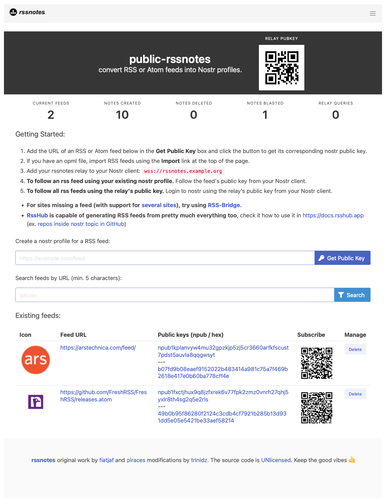

# RSSNOTES

rssnotes is nostr relay that functions as an rss to nostr bridge by creating nostr profiles and notes for RSS feeds. rssnotes is a read only relay.  rssnotes is a fork of [rsslay](https://github.com/piraces/rsslay).

## Features
- Parsing of RSS feeds to Nostr profiles.
- Creates a pubkey, npubkey and QR code for each RSS feed profile that you can use to follow the RSS feed on nostr.
- The rssnotes relay also has its own pubkey.  The rssnotes relay pubkey automatically follows all of the rss feed profiles. So if you login to nostr as the rssnotes relay you will see all of your RSS feeds.
- Option to import and export multiple RSS feeds at once using an opml file.
- Option to automatically remove old kind-1 notes.
- Search bar
- Relay logs exposed on the /log path.

## Screenshot



## Run the relay as a service
1. Create a new folder called rssnotes.
2. Copy the rssnotes binary to the folder.
3. Copy the files sample.frens.json, sample.seedrelays.json sample.env, and the templates folder to your folder. Change the names of the files to .env, frens.json and seedrelays.json. 
4. Open the .env file and add values for the following REQUIRED environment variables. 
- **RELAY_PRIVKEY** --- Use a nostr key generator to create a new set of nostr private and public keys for the relay. DO NOT USE your own existing nostr keys.  The relay will use these keys to follow all of your rss feeds and other background tasks. 
- **RELAY_PUBKEY** --- aquired from the new keys you created above.
- **RELAY_URL**  --- the URL of your relay ex.: myrssrelay.com.  This is only used to display on the relay's main page.  It does not affect your relays real URL.
- **RANDOM_SECRET** --- This is used to generate the nostr public/private keys for your relays rss feeds.  This should be a randomly generated string at least 20 characters long.
5. The remaining variables in the sample.env file are optional.

6. Create a systemd service file:

```console
sudo nano /etc/systemd/system/rssnotes.service
```

7.  Add the following contents:

```config
[Unit]
Description=RSSNotes Relay Service
After=network.target

[Service]
User=myuser
Group=myuser
ExecStart=/home/myuser/rssnotes/rssnotes
WorkingDirectory=/home/myuser/rssnotes
Restart=always
MemoryLimit=2G

[Install]
WantedBy=multi-user.target
```
8. Replace /home/myuser/ with the actual paths where you cloned the repository and stored the files.

9. Reload systemd to recognize the new service:

```console
sudo systemctl daemon-reload
```

10. Start the service:

```console
sudo systemctl start rssnotes
```

11. Enable the service to start on boot:

```console
sudo systemctl enable rssnotes
```

